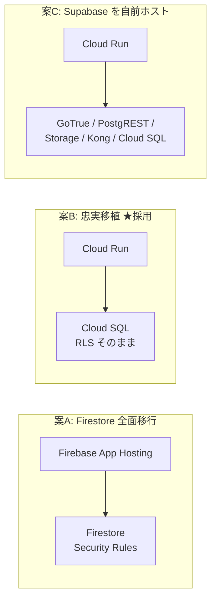
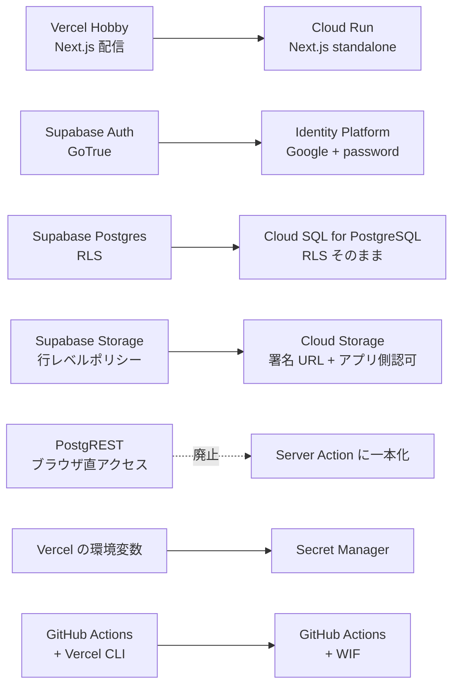
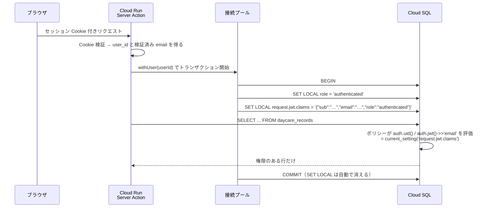
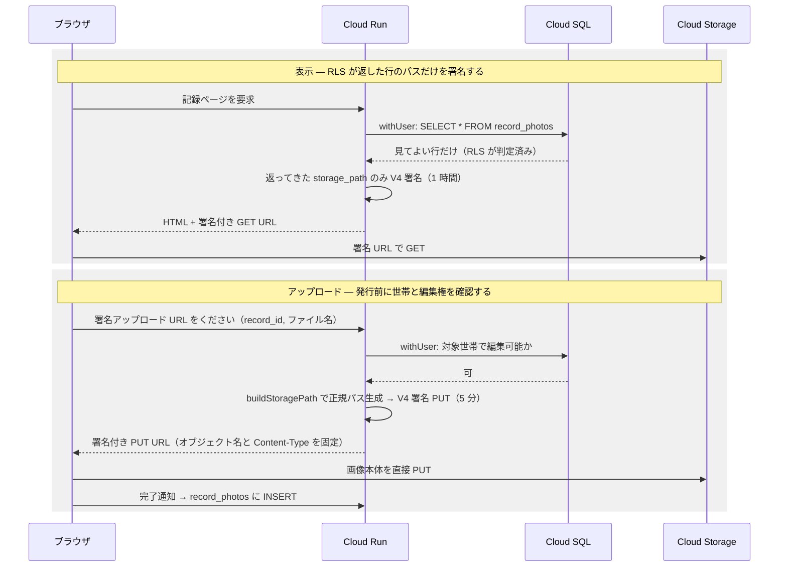
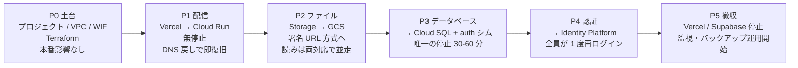

# インフラを Google Cloud へ寄せる — アーキテクチャ案

Vercel Hobby + Supabase Free（[D18](./decisions.md)）で動いている mfmf を、
**Google Cloud だけで完結する構成**へ置き換えるための設計案です。まだ決定ではありません
（採否を決めたら [decisions.md](./decisions.md) に 1 行足してください）。

このドキュメントは「なぜその形か」と「どこが難所か」を残すためのものです。
現状の仕様（テーブル・画面・RLS）は書きません（[D16](./decisions.md)）。正はコードです。

---

## 0. 先に結論

| | |
| --- | --- |
| **採る形** | Cloud Run（Next.js）＋ Cloud SQL for PostgreSQL ＋ Identity Platform ＋ Cloud Storage |
| **守るもの** | `public` の **RLS 90 本**、**Storage に触らない関数定義 18 本**、**pgTAP 5 ファイル**を無改変で動かす |
| **作り直すもの** | Storage の行レベルポリシー 43 本、**`delete_own_household` 1 本**、**pgTAP 4 ファイル**（§4.2） |
| **捨てるもの** | ブラウザ → PostgREST の直接アクセス（`supabase-js` のクエリビルダ） |
| **費用** | **月 ¥0 → 約 ¥1,800**（Cloud SQL がほぼ全部）。D18 の「無料枠で完結」は成立しなくなる |
| **止まる時間** | **計画停止は DB 切替（P3）の 1 回だけ、30〜60 分程度。** ただし **P1 のドメイン切替は「無停止」ではありません** —— 証明書の発行が DNS の反映を待つため、方法によっては HTTPS が一時的に失敗します（§7）。**先に証明書を検証できる切替方法を採るか、P1 にも停止時間を見込むこと** |

**最大の懸念を先に書きます。この移行の対価は月 ¥1,800 と運用対象の増加で、
D18（無料枠で完結・運用対象を増やさない）と正面から衝突します。**
それでも意味があるのは、Free 枠には無い**自動バックアップ・PITR・写真の世代管理**が
手に入り、[D22](./decisions.md) が「唯一のロールバック資産」「写真の事故からは戻せない」と
書いて許容していたリスクが消えるからです。ここを引き受けるかどうかが唯一の判断ポイントで、
以降はそれを引き受けた前提で最後まで設計してあります。

---

## 1. いま何を移すのか

移行の規模は Supabase への依存の深さで決まります。棚卸すとこうなります。

| 依存している Supabase の機能 | 規模 | 移行の難度 |
| --- | --- | --- |
| Postgres のテーブル | 13 | 低（`pg_dump` / `pg_restore`） |
| **`public` の RLS ポリシー** | **90** | **中 — `auth.uid()` を自前で再現できるかに全部かかっている** |
| **`storage.objects` の RLS ポリシー** | **43** | **高 — Cloud Storage に等価物が無い。設計を変える** |
| SECURITY DEFINER ほかの関数定義 | 19 | 低 — ただし **`delete_own_household` だけは `storage.objects` / `storage.foldername()` を直接引く**ので作り直し（§4.2） |
| pgTAP のテナント分離テスト | 9 ファイル | **5 ファイルは無改変。4 ファイルは Storage を触るので作り直し**（§4.2） |
| Auth（Google OAuth + email/password、Cookie セッション） | — | 中（UID を保ったまま移せるかが鍵） |
| Storage（private バケット 2 つ、ブラウザ直アップロード、署名 URL） | — | 高 |
| Realtime / Edge Functions | **未使用** | — |

未使用のものが 2 つあるのは幸運です。移すのは **DB・認証・ファイル**の 3 つだけで、
そのうち難所は **RLS の再現**と **Storage の認可**の 2 点に集中しています。

---

## 2. 3 つの案と、却下したもの

> **この節は要約です。** 評価観点を外部の枠組み（Well-Architected の 6 本柱／技術選定の
> MCDA・ADR／ロックインの出口テスト）から引き直し、レイヤごとの候補を出して重み付きで
> 採点し直したものが [gcp-tech-selection.md](./gcp-tech-selection.md) にあります。
> **結論（案 B）は変わりませんでしたが、配信層に対抗馬（Firebase App Hosting）が 1 つ増え、
> 「GCP に無料の Postgres は無い」という前提が不正確だったことが分かりました。**

| 案 | 費用/月 | コード変更 | 却下/採用の理由 |
| --- | --- | --- | --- |
| **A. Firestore + Firebase App Hosting** | 約 ¥0 | **全面書き換え** | **却下。** 費用は最良だが、13 テーブルの結合・`pg_trgm` の部分一致検索・**90 本の RLS と 9 本の pgTAP** が全部消える。セキュリティの一次防衛線を書き直したうえで、それを守るテストも書き直すことになる（`CLAUDE.md` セキュリティ節の前提が崩れる）。家族 5 人のアプリでこのリスクを取る理由がない |
| **B. Cloud Run + Cloud SQL + Identity Platform + GCS** | 約 ¥1,800 | **データアクセス層 ＋ Storage ＋ 認証** | **採用。** SQL と RLS が資産として残り、`auth` 互換シム（§4.1）で **`public` のポリシー 90 本と Storage に触らない関数・pgTAP 5 ファイルは無改変**で動く。ただし作業は「データアクセス層だけ」では終わらない —— **Storage のアップロード/削除経路、`.auth.*` 48 箇所とログイン/登録/再設定/OAuth の各フロー、migration のベースライン、Storage 系 pgTAP 4 ファイルの Integration への作り替え**が必須（§4・§7） |
| **C. Supabase OSS を Cloud Run で自前ホスト** | 約 ¥3,500〜 | **ほぼ無し** | **却下。** コード変更が最小という一点は魅力だが、GoTrue・PostgREST・storage-api・Kong の 4 コンテナを自分でバージョン管理・監視・アップデートすることになる。「運用対象を増やさない」（D18）に最も強く反する案で、費用も一番高い。コードを守るために運用を買うのは逆 |

---

## 3. 目標アーキテクチャ

### 3.1 レイヤの対応

置き換えの中で**唯一なくなる箱が PostgREST** です。今はブラウザから直接 DB を触る経路が
残っていますが（`src/lib/supabase/client.ts`）、Cloud SQL は Private IP に閉じるので
**データの読み書きは全て Server Action / Server Component 経由**になります。
これは制約であると同時に、`CLAUDE.md` の「データ変更は Server Action で行う」規約に
実態を合わせることでもあります。

### 3.2 リクエストの経路

要点は 3 つです。

- **画像の本体は Cloud Run を通りません。** 今も Vercel の 4.5MB ボディ上限を避けるために
  ブラウザから Storage へ直接上げていますが（`RecordForm`）、この形はそのまま維持します。
  Cloud Run の上限は 32MB なので制約としては緩みますが、**転送とメモリを Cloud Run に
  払わせない**利点の方が大きいので変えません。
- **Cloud SQL は Public IP を持ちません。** Cloud Run から VPC 直接エグレスで Private IP に
  つなぎます。インターネットから DB に到達する経路が存在しない状態にします。
- **サービスアカウントの JSON 鍵はどこにも置きません。** 署名 URL の発行は鍵ファイルではなく
  IAM の `signBlob` で行い（§4.2）、GitHub Actions は Workload Identity 連携で認証します（§5）。
- **`NEXT_PUBLIC_*` は Secret Manager では配れません。** §3.1 の表で「環境変数 → Secret Manager」と
  まとめましたが、**それは実行時に読む値の話**です。`NEXT_PUBLIC_*` は
  **ビルド時にブラウザ用バンドルへ焼き込まれる**ので、いまの CI のように
  プレースホルダでビルドしたイメージを Cloud Run に置くと、**P1 の時点でログインと
  Storage への直接アップロードが壊れます**（P4 でブラウザ側 Identity Platform の
  設定を配るときも同じ）。これらは**秘密ではない**ので、
  **ビルド時に渡す**か、**実行時に読む設定ドキュメントを配る**経路を別に用意すること。

### 3.3 配信まわりの割り切り

| 論点 | 決め |
| --- | --- |
| 独自ドメイン | **Cloud Run のドメインマッピング**を使う。グローバル外部 ALB は転送ルールだけで月 ¥2,700 ほどかかり、家族 5 人のアプリでは CDN と Cloud Armor の価値が費用に見合わない |
| コールドスタート | **最小インスタンス 0**。常時 1 台にすると月 ¥1,500〜9,000 上乗せになる。**遅延は利用者に見えます** —— `public/sw.js` はナビゲーションを `fetch(request).catch(() => caches.match("/offline"))` で処理しており、**ネットワーク応答を待ちます**（アプリシェルを先に出す実装ではない）。したがって初回遷移はコールドスタート分だけ白いまま。P1 で実測し、許容できなければ最小 1 台へ倒す |
| next/image の最適化 | **不要**。リモート画像は全て `unoptimized` で、縮小はブラウザ側（[D20](./decisions.md)）。`sharp` を積む必要がない |
| リージョン | `asia-northeast1`（東京）。利用者も Cloud SQL も同じ場所に置く |

---

## 4. 難所は 2 つ半

### 4.1 難所その 1 — RLS を Supabase 無しで動かす

**RLS を捨てないことがこの移行の成否です。** `CLAUDE.md` が「セキュリティの一次防衛線は
Supabase の RLS」と書き、pgTAP がそれを CI で守っている以上、ここを弱めた時点で移行は失敗です。

Supabase がやっていることは、実は魔法ではありません。PostgREST が JWT を検証し、
**トランザクションの頭で 2 行の `SET LOCAL` を実行しているだけ**です。
`auth.uid()` はその設定値を読む関数にすぎません。であれば、同じことを自分でやればよい。

用意するのは以下だけです。

- **`auth` スキーマの互換シム** —— **通常の migration として後ろに足してはいけません**（後述）
  - `auth.uid()` / `auth.jwt()` / `auth.role()` — `current_setting('request.jwt.claims', true)` を読む
  - ロール `anon` / `authenticated` / `service_role`
  - **`auth.users` テーブル** — 13 箇所の外部キーの参照先。Identity Platform を正とし、
    サインイン時に `id` / `email` **とメール確認状態**を upsert して同期する（下記）
- **`withUser()` ヘルパー**（`src/lib/db/`）— 上のシーケンスの `SET LOCAL` を必ず通す唯一の入口
- **接続プール専用のログインロール** —— これが無いと上のシーケンスは 1 行目で落ちます（下記）

> **claims には `email` も必ず入れること。** `sub` と `role` だけでは足りません。
> `20260704010000_household_invites.sql:79` の `invites_select_invitee` は
> `lower(email) = lower(coalesce(auth.jwt() ->> 'email', ''))` で判定しているため、
> `email` が空だと**招待の受諾画面（`/invite/[token]`）が全ての有効な招待を「無効」と表示します。**
> 入れる値は **ID プロバイダが検証済みとしている email** に限ること（自己申告の email を
> 入れると、他人の招待を受諾できる経路になります）。

> **claims を締めるだけでは穴が塞がりません。** 招待受諾の本体
> `accept_household_invite` は **`auth.jwt()` ではなく `auth.users` を直接読んでいます**
> （`20260705010000_guest_invites.sql:96` の `select lower(u.email) ... from auth.users`）。
> つまり**未確認のメールを互換テーブルに書いた時点で、claims の制限を迂回して
> 招待やゲスト付与を受け取れます**（招待一覧の SELECT ポリシーで行が見えなくても、
> トークンさえ知っていれば RPC は通る）。対応は 2 つのどちらか。
>
> - **未確認のメールを `auth.users` に書かない**（確認済みになるまで `email` は NULL のまま）。
>   **保存された関数に手を入れずに済むので、こちらを既定にします。**
>   代償として、未確認ユーザーはメンバー一覧でメールが空に見えます
> - **確認状態を列として持ち、RPC 側で検査する。** 表示は自然になりますが、
>   **「無改変で残す関数」がもう 1 本減ります**（§4.2 の `delete_own_household` に次いで 2 本目）

> **`auth.users` への同期は、アプリのプールからは書けません。** 上で決めたログインロールは
> **テーブル所有者でない `authenticated` 相当**なので、互換テーブルへの upsert 権限がありません。
> かといって**素直に UPDATE 権限を与えると、アプリの任意のクエリが他人の identity の
> email を書き換えられる**ようになり、この表を信頼している招待系の関数
> （`accept_household_invite` ほか）がまるごと崩れます —— **`withUser()` の中で
> 認可を握っているのは RLS なのに、その前提となる identity 自体を書けてしまう**からです。
> **サーバーが検証した identity だけを受け取り、行の id を認証済みの本人に束縛する
> 狭い SECURITY DEFINER 関数**（または同期専用のプロビジョニングロール）を用意すること。

> **接続プールのロールを別に用意すること。** 普通のログインロールは、`authenticated` を
> **GRANT されていない限り `SET ROLE authenticated` を実行できません**（毎クエリの 1 行目で落ちます）。
> かといって手近な `postgres` / migration 用アカウントで通すと、**スーパーユーザーまたは
> テーブル所有者として RLS を素通りする**ので、`withUser()` を 1 箇所でも迂回した瞬間に
> テナント分離が消えます（一次防衛線が消える = 最悪の失敗の仕方）。用意するのは
> **スーパーユーザーでない・テーブル所有者でない・`BYPASSRLS` を持たない専用ログインロール**で、
> `authenticated` を `NOINHERIT` で GRANT します（明示的に `SET ROLE` したときだけ権限が乗る）。
> **migration 用の資格情報はアプリのプールに入れないこと。**

### 4.1.1 履歴をそのまま再生できるようにする —— ベースラインを切る

シムの話には続きがあります。**`auth` だけ用意しても、素の `postgres:17` では履歴の再生は
`init.sql` で止まります。** 依存しているのは `auth` だけではないからです。

| 依存 | 場所 |
| --- | --- |
| `storage.buckets` への `insert` | `20260616130704_init.sql:128` |
| `storage.objects` へのポリシー、`storage.foldername()` | `init.sql:134-155` ほか、後続の migration 多数 |
| `extensions` スキーマ（`pg_trgm` の置き場所） | `20260616130707_record_search.sql:11` |

既存の migration は編集しない方針なので、選択肢は 2 つです。

1. **ベースラインを切る（推す）** —— P3 の切替時点のスキーマをダンプし、
   **Storage 関連を除いたベースライン**を新しい起点にする。以後の CI・staging・
   災害復旧はベースライン＋それ以降の migration だけを再生する。**Storage の残骸を
   1 行も持ち込まずに済む**のが利点で、履歴の再生自体は P3 で一度きりなので失うものは少ない。

   > **ただし「`0000_baseline.sql` を置く」だけでは起点になりません。** マイグレーションの
   > 実行順はファイル名順なので、`0000_...` は既存の `2026...` より**前**に走り、
   > そのあと **`init.sql` 以下の履歴がそのまま再生されてしまいます**（＝ Storage 依存で
   > 落ちる状態に逆戻り）。**旧い migration を置くディレクトリごと分ける**か、
   > **ベースライン適用時に「それ以前のバージョンは適用済み」と管理テーブルへ記録する**か、
   > どちらかを必ずセットで用意すること。**ここを踏み外すと、CI も staging も
   > 災害復旧も同じ場所で落ちます。**
2. **Storage 互換スキーマも bootstrap に入れる** —— `storage.buckets` / `storage.objects` /
   `storage.foldername()` の**空の器**を作って履歴を通す。手数は少ないが、**誰も読まない
   テーブルにポリシー 43 本がインストールされた状態**が残る

**2 を採る場合は、その器が不活性であることを明示すること。** §4.2 で「ダミースキーマで
pgTAP を緑にするのは最悪手」と書いたのと同じ罠が、ここでも口を開けています ——
器があると、Storage の pgTAP が**何も守っていないのに通ってしまう**。

これで **`public` の 90 本のポリシー**と、**Storage を参照しない 18 本の関数定義**、
**9 ファイル中 5 ファイルの pgTAP** は 1 行も変えずに動きます。
残りは Storage 側の事情で作り直しになります（§4.2）。
なお pgTAP は `supabase` CLI を起動せずローカルの Postgres コンテナで回せるようになり、CI は速くなります。

> **ただし公式の `postgres:17` イメージに pgTAP は入っていません。** 残す 5 ファイルも冒頭で
> `create extension pgtap` を実行するので、**素のイメージのままだと RLS のアサーションに入る前に落ちます。**
> pgTAP 入りのイメージを使うか、コンテナ起動時にインストールする手順を CI に足すこと
> （`extensions` スキーマを作るだけでは `pg_trgm` の話しか解決しません）。

> **`SET LOCAL` であることが重要です。** 接続プールで使い回すので、`SET`（セッション単位）だと
> 前のリクエストのユーザー権限が次のリクエストに漏れます。トランザクション外で DB に触る
> 経路を作らないこと、`withUser()` を迂回する生の `pool.query()` を書かないことを、
> lint ルールか `eslint-plugin-no-restricted-imports` で機械的に縛るべきです。

書き換えが要るのは **`supabase.from(...)` を呼んでいる箇所**（Server Action と Server Component の
データ取得）です。ここは素の SQL でも Kysely 等でも構いませんが、`withUser()` の外では
実行できない形にしておきます。

**`supabase.rpc(...)` の呼び出しも同じだけ書き換えが要ります。** 関数定義を DB に残すことと、
それを呼ぶ HTTP 経路（PostgREST）を残すことは別の話です。PostgREST を落とすと、
以下の 5 箇所は**実行経路を失います**（`withUser()` 経由のパラメータ化した関数呼び出しへ移す）。

| 呼び出し元 | 関数 | 失われる機能 |
| --- | --- | --- |
| `src/app/onboarding/actions.ts:21` | `create_own_household` | 世帯未所属ユーザーのオンボーディング |
| `src/app/invite/actions.ts:15` | `accept_household_invite` | 内部/ゲスト招待の受諾 |
| `src/app/(app)/settings/page.tsx:63` | `get_household_members` | メンバー一覧の表示 |
| `src/app/(app)/settings/page.tsx:100` | `get_household_guests` | ゲスト一覧の表示 |
| `src/app/(app)/settings/actions.ts:391` | `delete_own_household` | 世帯の削除 |

これらのテストも併せて移します。

**アプリの外にも 1 つあります。** `scripts/feedback-to-issues.mjs` は
`supabase.auth.signInWithPassword()` でログインし、`.from("feedback")` で読み書きする
**保守用コマンド**です。Server Action でも Server Component でもないので上の棚卸しから漏れていました。
P5 で Supabase を止めた時点で**ご意見の棚卸しができなくなる**ので、Identity Platform 認証と
サーバー側の認可経由に書き換えるところまでを移行のスコープに入れます。

### 4.2 難所その 2 — Storage の 43 本のポリシーを何に置き換えるか

**Cloud Storage にはオブジェクト単位の宣言的ポリシーがありません。** Firebase の
Storage Rules はありますが、判定に「その世帯のメンバーか」を Postgres へ問い合わせることが
できないので、`{household_id}/{record_id}/{filename}` 規約の認可には使えません。

そこで **「RLS が返した行だけ署名する」** という形にします。認可の判断者は RLS のままです。

- バケットは **均一バケットレベルアクセス**＋**公開アクセス防止**を強制。匿名で読める経路をなくす
- 署名 URL は**オブジェクト名まで固定**して発行する。パスはクライアントの申告ではなく
  `buildStoragePath()` がサーバー側で組み立てる（`src/lib/storagePath.ts` はそのまま使える）
- **サイズ上限をサーバー側で縛る。** オブジェクト名と `Content-Type` だけ固定しても、
  **本文の大きさは実質無制限**です。`RecordForm` を経由せず発行済み URL を直接使えば、
  正規の editor（あるいは乗っ取られたセッション）が**巨大なオブジェクトを置いて
  ストレージ課金を膨らませられます**。[D20](./decisions.md) のクライアント側リサイズは
  帯域のための最適化であって**上限の強制ではありません**。署名前にサイズを検証し、
  **`Content-Length` を署名に束縛する**か、**サーバー側で最大値を強制するアップロードポリシー**を使うこと
- **発行そのものにも上限を置く。** 1 個あたりのサイズを縛っても、**URL を何本でも発行させれば
  総量は青天井**です（毎回ちがう UUID のパスになるので衝突もしない）。DB への insert を
  完了させなければ孤児掃除の猶予（24 時間）ぶんは残り続け、**予算アラートは「もう発生した課金」を
  止めません**。署名の発行口に**ユーザー / 世帯あたりのレート制限と、世帯あたりの総容量の上限**を付けること
- **署名アップロード要求には `household_id` を含め、その世帯を直接検証する。**
  上の図は「`record_id` とファイル名」と書きましたが、**新規作成ではそれだけでは世帯を決められません** ——
  `RecordForm` は `crypto.randomUUID()` で `record_id` をクライアント生成し、
  `daycare_records` の行ができる**前に**アップロードするからです（`RecordForm.tsx:71,163`）。
  かといって**「現在世帯」の Cookie で代用してはいけません** —— 複数世帯に属するユーザーが
  別タブで世帯を切り替えると、**画面 A の記録に世帯 B のパスを署名**してしまい、
  保存が落ちたうえに孤児オブジェクトが残ります（`CLAUDE.md` が名指しで警告している取り違え）。
  **新規は画面が描画された世帯 id を要求に載せてメンバーシップと編集権を検証し、
  既存記録への追加は対象行の `household_id` から導出する**、と分けます
- 署名は**サービスアカウント鍵ではなく IAM の `signBlob`** で行う。Cloud Run のサービス
  アカウントに自分自身への `roles/iam.serviceAccountTokenCreator` を与えれば、鍵ファイル無しで V4 署名できる。
  **`signBlob` だけでは足りません** —— 署名を作れるようになるだけで、**GCS は署名付きリクエストを
  そのサービスアカウントとして認可する**ので、バケットに対する `storage.objects.get`（読み）と
  `storage.objects.create`（アップロード）が無いと**発行した URL は全て 403 になります**。
  削除・掃除の経路にも対応する権限を、バケット単位の最小権限で付けること
- **バケットに CORS 設定を入れる。** 署名 V4 の PUT は GCS 側では通っても、`Content-Type` を
  付けるためブラウザが preflight（`OPTIONS`）を投げます。アプリのオリジン・`PUT`・
  必要なヘッダを許可しておかないと、**署名が正しくても全てのアップロードがブラウザで落ちます。**
  P2 のインフラ手順に必ず含めること
- **PUT だけ成功して INSERT が失敗した孤児オブジェクト**は必ず出るので、Cloud Scheduler +
  Cloud Run ジョブで日次掃除する。**掃除の対象は 2 バケット・参照元は 4 つ** ——
  写真は `record_photos`、アバターは `profiles.avatar_path` / `households.avatar_path` /
  `pets.avatar_path`。アバターにも PUT と DB 更新の間の窓があり（タブを閉じる・通信が切れる・
  Server Action が失敗する）、**写真だけを見る掃除では永久に拾われません**。

  **この掃除は `withUser()` では書けません。** バケット全体のオブジェクトを
  **全世帯の参照と突き合わせる**必要があるのに、`withUser()` が課す `authenticated` ＋ RLS では
  **他の世帯の行が見えない** —— つまり「参照されているのに見えない」オブジェクトを
  **孤児と誤判定して消してしまいます**（猶予 24 時間の後に、他人の写真が消える）。
  かといって migration 用アカウントで走らせると、§4.1 で分けた資格情報の分離が無意味になります。
  **掃除ジョブ専用のロールと、「このパスがどこかから参照されているか」だけを返す
  狭い SECURITY DEFINER 関数**を用意し、**別世帯のオブジェクトを消さないことを
  pgTAP か Integration のテストで固定すること。**
  **ただし「作成から一定時間（例: 24 時間）以上経過したもの」に限ること** —— 正常な
  アップロードでも PUT 成功から INSERT までには必ず間があり、その隙に掃除が走ると
  **INSERT は成功するのに実体が消えた行**ができます。
  **ただし「経過時間」だけでは閉じません** —— ブラウザが PUT 成功後にサスペンドされ、
  **24 時間より後に復帰して INSERT を完了する**ことがあり得ます（掃除はもう消している）。
  **署名を発行する時点で「予約」の行を作り、完了時にそれを消費する**形にし、
  あわせて、**完了時にオブジェクトの実在を確認**して、消えていたら参照を作らずに失敗させます。
  **予約には必ず期限を持たせること** —— 「予約のあるオブジェクトは掃除しない」とだけ決めると、
  **一番ありふれた失敗（PUT 成功後にブラウザが落ちて完了通知が来ない）で予約が残り続け、
  そのオブジェクトは永久に掃除対象外**になります（＝私的な写真と課金が消えずに積み上がる）。
  期限は署名 URL の有効期限 ＋ 猶予に合わせ、**期限切れの予約が付いたオブジェクトは掃除の対象**、
  **期限切れ後の完了通知は拒否**します

#### アバターのバケットも設計する

写真だけ設計して終わりにはできません。**private バケットは 2 つあります。**
`AvatarUploader` は `buildAvatarPath()` で `avatars` バケットへ直接上げており、
規約は `{scope_id}/avatars/{...}`、参照元テーブルは 3 つ（`profiles` / `households` / `pets`）ですが、
**`scope_id` は 2 通りしかありません** —— **ユーザーアバターは `owner_id`、世帯アバターと
ペットアバターはどちらも `household_id`** です（`20260706120000_avatars.sql` の
`avatars_{select,insert,delete}_scope` 3 本）。写真用の「`record_id` を渡す」経路も
`buildStoragePath()` の規約もそのまま流用できません。

> **ペットの `scope_id` に `pet_id` を使ってはいけません。** 現状の更新経路は
> `isAvatarPathForScope(newPath, pet.household_id)`（`pets/actions.ts:127`）で
> **そのペットの所属世帯で始まるパスしか受け付けない**ので、`{pet_id}/avatars/...` に署名すると
> **GCS への PUT だけ先に成功し、そのあと Server Action がパスを弾いて**
> ペットのアバター更新が必ず壊れます。ペット用の発行口は**対象のペット行を引いて、
> その `household_id` でパスを組む**こと。

したがって **P2 では署名 URL の発行口を「操作」ごとに分けて用意します。**
パスのスコープが同じ `household_id` でも、**操作によって必要な role が違う**からです
（世帯アバターとペットアバターで違います）。

> **ここに「操作 → 必要な role」の対応表は置きません。** `CLAUDE.md` が
> 「ここに対応表を持つとコードと二重管理になり、**実際にこの表は 2 度間違えた**（D16）」と
> 名指しで警告しているとおりで、**一度書いた表を消しました**（3 度目をやりかけました）。
> **正は `src/app/(app)/settings/actions.ts` と `src/app/(app)/pets/actions.ts` の
> 各アクションです。** 実装時はそこを読んで、**その操作が実際に要求している role を
> そのまま署名の条件にする**こと。表を写すと、権限が変わったときに
> **署名だけが広いまま取り残されます。**

**「世帯のメンバーか」だけで署名すると、本来 owner だけの操作を viewer に許すことになります。**
そのあと DB 更新の側で弾かれるとしても、**不正なオブジェクトとその課金はもう発生しています。**
発行口は**対象の行を引いて、その操作に必要な role を確かめてから**署名すること。判定は写真と同じく
「RLS が返したか」に寄せ、**差し替え時の旧オブジェクト削除**（いま
`settings/actions.ts` と `pets/actions.ts` が `remove()` でやっていること）も
サーバー側の削除経路として作り直します。ここを P2 のスコープに入れ忘れると、
アバターの表示・変更・削除が丸ごと壊れます。

#### `delete_own_household` は書き直しになる

「関数はそのまま動く」の唯一の例外です。`20260705040000_household_delete.sql` の
`delete_own_household` は `storage.objects` を直接引き、`storage.foldername(o.name)[1]` で
**その世帯の写真が残っている間は削除を拒否する**ガードを持っています。
Supabase Storage のスキーマが無くなればこの関数は**インストールすら失敗**し、
空の互換テーブルを置けば**ガードが常に素通りして、実体の残った GCS オブジェクトを
置き去りに世帯とメンバーシップだけが消えます**（どちらも許容できない）。

**GCS のプレフィックス確認は、認可済みの削除フロー側（Server Action）へ移します。**
DB 側の関数からは Storage 依存のガードを外し、「オブジェクトが残っていないこと」の
確認と実削除はアプリが行う、という分担にします。

**ただし「プレフィックスが空か見る」だけでは競合します。** 5 分有効の署名 PUT URL を先に
受け取っておけば、削除処理が空を確認 → 世帯とメンバーシップを削除 → **その後で PUT が成功**
という順序が起こり得ます。**GCS は署名の発行時にしか認可を見ないので、いまの Storage RLS の
ように「書き込みの瞬間にメンバーシップを再評価する」ことをしてくれません。** 手順はこうします。

1. 世帯を「削除中」に印を付ける
2. **以後その世帯向けの署名を発行しない**
3. **その世帯の予約が全て決着する（消費されるか期限切れになる）まで待つ**
4. プレフィックスが空であることを確認し、実体を消してから世帯を削除する
5. **そのプレフィックスを「削除済み」として記録に残し、掃除のジョブが以後も
   繰り返し掃く**（一定期間ずっと空だったら記録を落とす）

> **時刻を基準にした「待ち」では、この競合は原理的に閉じません。**
> 期限の直前に始まって**本文の送信中に停滞している PUT は、期限を過ぎても打ち切られず**、
> **アップロード中のオブジェクトは完了するまで一覧に現れない**ので、
> **何度確認しても、その瞬間はプレフィックスが空に見えます。**
> 予約に期限を付けても「予約は期限切れ、PUT はまだ飛んでいる」状態を作れるだけで、
> **安全な打ち切り点は存在しません。**
>
> **なので「1 回確認して終わり」をやめます。** 削除した世帯のプレフィックスを
> **tombstone（削除済みの印）として残し、掃除のジョブが以後も繰り返しそのプレフィックスを
> 掃く**ようにします。**一定期間、連続して空だったら tombstone を落とす。**
> より確実にするなら、**予約の消し込みを時刻ではなく GCS のオブジェクト確定通知
> （Pub/Sub の finalize イベント）で行う** —— 実際に「置かれた」ことを signal にすれば、
> 遅れて届いた PUT も必ず掃除の対象に入ります。

#### pgTAP は 5 ファイル残り、4 ファイルは作り直す

「pgTAP 9 ファイルを無改変」とは書けません。`storage.` を参照しているのは 4 ファイルで、
Storage スキーマの無い素の Postgres では**そのまま落ちます**。
互換用のダミースキーマを置いて緑にするのは**最悪手**です —— 新しい GCS 認可を
何も検証しないまま「テストは通っている」ように見えるからです（V4: 壊れても緑に見える）。

| pgTAP ファイル | `storage.` 参照 | 移行後 |
| --- | --- | --- |
| `guest_grants_test` / `guest_invites_test` / `household_invites_test` / `household_provisioning_test` / `household_rls_test` | 0 | **無改変** |
| `household_delete_test` | 1 | Storage ガードの分だけ剥がす |
| `household_rbac_test` | 5 | Storage 部分を剥がす |
| `household_storage_tags_test` | 21 | Storage 部分は削除し、tags 部分だけ残す |
| `avatars_test` | 24 | **ほぼ全部が Storage ポリシー**。作り直し |

剥がした分の担保は **Integration 層（Vitest + 実 DB + fake-gcs-server）へ移します** ——
「どのスコープなら署名 URL が発行されるか / されないか」を検証する層です。
[D30](./decisions.md) の割り当て原則（その層でしか捕まらないものを置く）に従うと、
アプリ層の認可判断は元々 Integration の担当なので、位置としても正しい移動になります。
**この移し替えを P2 の完了条件に含めること。**

**これは `CLAUDE.md` の記述を変える変更です。** 「一次防衛線は RLS」は DB については変わりませんが、
**Storage については「アプリ層の認可 ＋ 短命の署名 URL」に変わります。**
移行時にセキュリティ節を書き換えてください（黙って変えると、次のセッションのエージェントが
古い前提で Storage を触ります）。

代わりに得るものもあります。**オブジェクトのバージョニングとソフト削除**を有効にすれば、
D22 が「写真の事故からは戻せないことを許容」と書いた穴が埋まります。

> **ただしバージョニングは保持期間とセットで有効にすること。** アバターの差し替え・写真の
> 上書き・削除はいずれも**旧世代（noncurrent generation）を残し、消すまで課金され続けます**。
> ソフト削除の保持期間はこの旧世代を縛りません。**保持期間を決めて Object Lifecycle
> Management で消す**ルールを同時に入れないと、§6 の「約 ¥50」は青天井になり、
> さらに**削除したはずの私的な写真が意図より長く残ります**（後者のほうが問題です）。

### 4.3 難所その半分 — 認証と、Google Drive の refresh token

利用者から見て一番リスクが高いのは「ログインできなくなる」ことです。ここは
**UID を保ったまま移す**ことで、ほぼ無傷にできます。

- Supabase の `auth.users` **と `auth.identities`** を書き出し、**`uid` を指定したまま**
  Identity Platform へ一括インポートする。**`auth.users` だけでは Google の provider subject が
  保存されません** —— 「同じメールなら自動で紐づく」に頼ると、同一メール衝突時の挙動が
  設定依存なので、**初回ログインで別 UID が発行されたり「アカウントが既に存在します」で弾かれたり**
  します。そうなると、**インポート済みだが誰もログインできない UID に、全ての外部キーと
  世帯メンバーシップがぶら下がった状態**になります。`providerData` ごと入れ、
  **Google の初回ログインをリハーサルしてから** UID 保存を確定と見なすこと。
  パスワードは bcrypt ハッシュのまま持ち込めるので、**パスワード再設定は不要**
- UID が変わらないので、13 テーブルの `owner_id` / `user_id` は**一切書き換え不要**
- **`emailVerified` は全ユーザーぶん、Supabase の確認状態（`email_confirmed_at`）から写すこと。**
  Google のユーザーだけ立てて済ませると、**bcrypt を持ち込んだ email/password ユーザーが
  未確認扱いのまま**になります。§4.1 で「claims の `email` は検証済みのものだけ」と決めた以上、
  この人たちは **`email` claim を失って `invites_select_invitee` に当たらず、
  自分宛ての招待を受諾できません。** 逆に未確認のまま claim に入れれば、§4.1 の
  セキュリティ要件そのものを破ります。**email/password ユーザーでの招待受諾もリハーサルに含めること**
- セッションは Cookie（`__Host-session`）。Firebase Admin SDK の `createSessionCookie` で発行し、
  `src/middleware.ts` で検証する。**`src/middleware.ts` に Node ランタイムを明示すること** ——
  コンテナを Cloud Run で動かしても **Next.js の middleware は既定で Edge ランタイムのまま**で、
  Firebase Admin のセッション Cookie API は Node の API を要求します。明示しないと
  **P4 で全リクエストが落ちます**（明示せずに済ませたいなら、検証を middleware から出す）
- **Cookie の属性は自分で付けること。** `createSessionCookie` が返すのは**文字列だけ**で、
  Admin SDK は HTTP レスポンスの属性を設定してくれません。**`__Host-` 接頭辞は
  `Secure` ＋ `Path=/` ＋ `Domain` 無しでないとブラウザに拒否される**ので、
  付け忘れると**全員がログインできません**。また **`HttpOnly` を落とすと、
  長命の認証セッションが JavaScript から読めます**。
  `HttpOnly` / `Secure` / `SameSite` / `Path=/` / Domain なし / 有効期限、を
  セッションの契約として最初に決めること
- **セッション Cookie の検証は失効を見に行くものにすること。** 署名だけを見る検証だと、
  **パスワードをリセットしても、アカウントを無効化しても、リフレッシュトークンを失効させても、
  発行済みの Cookie は期限まで通り続けます** —— つまり「乗っ取られたので止める」操作が
  実際には止まりません。`verifySessionCookie(cookie, true)` のように失効を確認するか、
  Cookie を短命にして再検証する方式を決めること（毎リクエスト失効確認するとネットワーク往復が
  増えるので、**更新系と設定変更では必ず確認・閲覧のみは短命 Cookie で妥協**、のような
  切り分けを設計時に決めます）
- **セッション Cookie を発行するエンドポイントは、ログイン CSRF に対して閉じること。**
  任意の有効な ID トークンを受け付ける実装だと、**攻撃者が自分のトークンを被害者のブラウザから
  送り込んで被害者のセッションを差し替えられます**（被害者は気づかないまま攻撃者のアカウントへ
  記録や写真を書き込むことになる）。POST を発行元のブラウザに束縛する CSRF トークンを要求し、
  `createSessionCookie` を呼ぶ前に **`auth_time` が十分新しいこと**を確認します
- **移行時に全員が 1 度だけ再ログインします。** 事前に告知が要る唯一の利用者影響です

> **書き出しから切替までの間、アカウント系の操作を止めること。** §7.1 で書いた凍結は
> **P4 より後**の話で、**その手前の競合を塞いでいませんでした。** `auth.users` を書き出してから
> Identity Platform が正になるまでの間にパスワードを変えた人は**古いハッシュのまま持ち込まれ**、
> その間に登録した人は**そもそも入っていません**。どちらも切替後にログインできず、
> 「1 度だけ再ログインすれば済む」は成立しません。**書き出し〜切替の窓では、新規登録・
> パスワード変更・リセット・メール変更を凍結する**か、**差分を切替まで継続同期する**こと。

> **UID を保てるのは「移行してくる既存ユーザー」だけです。** P4 以降に新規登録する人には
> Identity Platform が**独自形式の不透明な UID**を振ります。一方 `auth.users.id` も
> 13 テーブルの `owner_id` / `user_id` も `auth.uid()` の契約も **`uuid` 型**なので、
> **新規ユーザーは互換テーブルに入らず `/onboarding` を完了できません。**
> どちらかを決めること —— **(a) サーバー側のプロビジョニング経路で UUID を採番し、
> それを UID に指定してアカウントを作る**（Admin SDK は UID 指定で作成できる）か、
> **(b) 外部 UID → 内部 UUID の対応表を持ち、RLS の claim には内部 UUID を入れる**。
> **(a) のほうが `auth.uid()` の契約に手を入れずに済みます** —— **ただし (a) だけでは
> Google ログインを塞げません。** フェデレーションの初回サインインでは、**アプリが何かを
> 呼ぶ前に Identity Platform 側でアカウントと UID が作られます**。つまり (a) が効くのは
> 「アプリが主導する登録」だけで、**Google の新規ユーザーは相変わらず UUID でない UID を
> 持って `/onboarding` に来ます。** したがって実際には
> **フェデレーション経路には (b)（外部 UID → 内部 UUID の対応表）が必須**か、
> **サーバー主導の OAuth ＋ カスタムトークンで発行を握る**かのどちらかになります。
> **「(a) を既定に」ではなく「(a) ＋ フェデレーションには (b)」が正しい形です。**

> **P4 の作業は `src/middleware.ts` だけでは終わりません。** リポジトリには
> **`.auth.*` の呼び出しが 48 箇所**あります。内訳は「セッション確認」（`getUser()` が大半で、
> Server Component と Server Action の冒頭に散っている）と「認証操作そのもの」
> —— `signUp` / `signInWithPassword` / `signInWithOAuth` / `updateUser({ password })` /
> `resetPasswordForEmail` / `signOut` / `exchangeCodeForSession`。
> **`__Host-session` を発行・検証できるようにしただけでは、これらは古いプロバイダを見続けます。**
> P5 で Supabase を止めた時点で、認証済みのページと更新系が**壊れるか、より悪いことに
> 古いプロバイダを信頼し続けます。** P4 の完了条件に **48 箇所の棚卸しと置き換え**を含めること。

**見落としやすい罠が 1 つあります。** `google_credentials` の refresh token です。
今は Supabase の Google OAuth が `provider_refresh_token` を返してくれるので
`/auth/callback` で保存できていますが（`src/lib/google/token.ts`）、
**Identity Platform のログインは Drive スコープの offline refresh token を返しません。**

したがって **Drive 連携はログインとは別の OAuth フローに分離**します。
「ログイン」＝ Identity Platform、「Drive 連携」＝ アプリ自身の OAuth 同意画面
（`google-auth-library` で `access_type=offline`）という 2 本立てです。
**この新しいフローには、セッションに束縛した使い捨ての `state` を必ず付けること。**
`state` を検証しないと、**攻撃者が自分の Google アカウントに対する認可を開始し、
被害者のブラウザでコールバックを踏ませて、被害者の `google_credentials` 行に
攻撃者の refresh token を保存させられます**。以後 Drive 書き出しを使うたびに、
**被害者の記録が攻撃者の Drive へ入ります。** `state` は発行時にセッションへ紐づけ、
**コードを交換する前に検証**すること（1 回限りで使い捨て）。

暗号化保存の仕組み（`src/lib/google/crypto.ts`）と `google_credentials` テーブルはそのまま使えます。
既存ユーザーの refresh token は Supabase の OAuth クライアントに紐づくため、
**クライアントを変えるなら Drive 連携だけは再同意が必要**です。

---

## 5. CI/CD と環境

いまの `deploy-production.yml` の骨格（**CI が緑のときだけ migration → デプロイ**）は
そのまま持ち込めます。変わるのは中身です。

| いま | 移行後 |
| --- | --- |
| `supabase db push` | migration 適用専用の **Cloud Run ジョブ**（アプリと同じイメージ・同じ VPC） |
| デプロイ前に `pg_dump` して Artifact に 90 日保存（**唯一のロールバック資産**） | **Cloud SQL の自動バックアップ ＋ PITR（7 日）**。加えてデプロイ直前にオンデマンドバックアップ |
| `vercel deploy --prebuilt --prod` | `gcloud run deploy --no-traffic` → `--to-latest` |
| 失敗したら Artifact から手で復元 | `gcloud run services update-traffic --to-revisions=前リビジョン=100`（数十秒）。**ただし下記の条件つき** |
| ローカルは `supabase start` | `docker compose`（postgres + Auth エミュレータ + fake-gcs-server） |
| CI で `supabase/setup-cli` を固定バージョン取得 | 不要になる（GitHub API のレートリミットで CI が落ちる問題も消える） |

`ci.yml` に昇格権限を足さない制約（`deploy-production.yml` からの `workflow_call` 再利用）は
そのまま守ります。WIF の権限はデプロイ側のワークフローにだけ持たせます。

> **「前リビジョンへ戻せる」は無条件ではありません。** migration はトラフィック切替の**前**に
> 適用されるので、その migration が**前リビジョンのイメージが使っている列・関数・契約を
> 壊していると、リビジョンを戻すコマンドは成功するのにアプリは動きません**（DB はもう新しい形）。
> デプロイ直前のバックアップは即時の戻し先にはならず、復元すれば切替後の書き込みも消えます。
> したがって **migration は expand / contract で書き、ロールバック窓が閉じるまで新旧どちらの
> リビジョンでも動く形を保つ**ことを規約にします（列は「足す → 使う → 消す」を別リリースに割る）。
> これを守らないリリースをするときは、**リビジョンのロールバックが効かないことを承知のうえで
> DB 復元を含む手順を先に決めてから**出すこと。

**環境は 2 つに増やせます。** Supabase Free は「active 2 プロジェクト」の制約があり
[D22](./decisions.md) は preview 用の別プロジェクトを断念していますが、Cloud SQL なら
同一インスタンス内に staging データベースを作るだけで済みます（追加費用ほぼゼロ）。
Cloud Run のリビジョンタグでプレビュー URL も出せます。
**ただし接続数はインスタンス単位で共有される**ので、staging のスケール上限も
§6.1 の予算に含めること（含めないと staging の E2E が本番を落とします）。

---

## 6. 費用（東京リージョン、家族数人の利用を想定）

| 項目 | 構成 | 月額の目安 |
| --- | --- | --- |
| **Cloud SQL for PostgreSQL** | 共有コア（db-f1-micro）、10GB SSD、ゾーン構成。**接続数の上限が小さいので §6.1 の制限とセット** | **約 ¥1,700** |
| Cloud Run | 最小インスタンス 0、月 200 万リクエストの無料枠内 | 約 ¥0 |
| Cloud Storage | 10GB Standard + 取り出し | 約 ¥50 |
| Identity Platform | 月間 5 万 MAU まで無料 | ¥0 |
| Artifact Registry | イメージ数世代 | 約 ¥30 |
| Secret Manager / Logging / Monitoring | 無料枠内 | 約 ¥0 |
| Cloud Run ドメインマッピング | ALB を使わない | ¥0 |
| **合計** | | **約 ¥1,800 / 月** |

**費用の 9 割以上が Cloud SQL です。** ここを削る手段は実質ありません
（GCP に無料の Postgres は無い）。逆に言えば、月 ¥1,800 は
「自動バックアップ・PITR・Private IP・staging 環境」を買う値段です。

### 6.1 安い機種を選ぶなら、接続数の予算も決める

**共有コアの Cloud SQL は同時接続数の上限が小さい**一方、**Cloud Run はインスタンスを
いくらでも増やせ**、`pg` のプールは 1 インスタンスあたり複数本張ります。放っておくと、
**CPU もリクエスト枠も余っているのに接続だけが枯れて、Server Component も Server Action も
全部落ちる**という壊れ方をします。安い機種を選ぶことと、**Cloud Run の最大インスタンス数と
1 インスタンスあたりのプールサイズを決めること**はセットです。

`最大インスタンス数 × プールサイズ ＋ 予備` が上限に収まるように決め、
**migration ジョブと運用（`psql` での調査）のぶんを必ず予備として残す**こと ——
障害調査のときに繋げないのが一番困ります。

**staging を同じインスタンスに置くなら、その接続も同じ予算に入れること。**
§5 で「同一インスタンス内に staging データベースを作るだけ」と書きましたが、
**接続数はデータベース単位ではなくインスタンス単位**です。staging のプレビューや E2E が走ると、
**本番と同じ小さな枠を奪い合い、staging のテストが本番を落とし得ます**。
staging 側にもスケール上限を課して同じ計算に含めるか、**別インスタンスに分ける**
（そのぶん費用が増える）かを決めること。

**必ず予算アラートを設定してください**（月 ¥3,000 で 50% / 90% / 100% 通知）。
Supabase Free と違い、GCP は上限に当たって止まるのではなく課金され続けます。
これは移行で新たに増えるリスクで、金額そのものより性質が変わる点が重要です。

---

## 7. 移行計画 — 5 段階、それぞれ単独で戻せる

一気に切り替えないこと。**各フェーズの終わりで本番が動いていて、前のフェーズへ戻せる**
順序にしてあります。難所（DB）を真ん中に置き、利用者影響のある認証を後ろに寄せています。

| | やること | 戻し方 |
| --- | --- | --- |
| **P0** | GCP プロジェクト、VPC、Artifact Registry、WIF、Secret Manager、Terraform 化。本番は Vercel + Supabase のまま | 何も本番に触っていない |
| **P1** | `output: "standalone"` 化と Dockerfile 整備、Cloud Run へデプロイ、ドメイン切替。**接続先は Supabase のまま**。証明書の発行時間を織り込む（下記） | DNS を Vercel に戻す（**キャッシュ済み TTL の分だけ遅れる**） |
| **P2** | GCS バケット作成、`rclone` で既存オブジェクトを同期（Supabase Storage は S3 互換なのでそのまま繋がる）、署名 URL 方式へ実装変更、**読み取りは一定期間 GCS 優先・無ければ Supabase にフォールバック**（下記のとおり存在確認が要る）、差分再同期 | **GCS にしかないオブジェクトを Supabase へ書き戻してから**リビジョンを戻す（下記） |
| **P3** | `auth` 互換シムを**プレマイグレーション**として整備、`withUser()` とデータアクセス層の書き換え、pgTAP をローカル Postgres で緑にする。**本番は読み取り専用にして、絞り込んだデータだけを Cloud SQL へ移す → 接続先切替**（下記）。ここだけ停止が要る | **書き込みを再度止め、Cloud SQL の差分を Supabase へ逆同期してから**接続先を戻す（下記） |
| **P4** | Identity Platform 設定、UID 保存の一括インポート、`.auth.*` 48 箇所の置き換え、セッション Cookie 実装、Drive 用 OAuth の分離、`auth.users` 同期 | **パスワード変更・リセットに加え、新規登録とプロバイダでの初回ログインも凍結したうえで**（凍結しないと IdP にしか存在しないアカウントが締め出される）ID プロバイダを Supabase Auth に戻す（§7.1） |
| **P5** | **旧経路のアップロードを塞ぎ、最後の差分同期と 2 バケットの突き合わせを終えてから**（下記）Vercel プロジェクト削除、Supabase プロジェクト一時停止（**すぐ消さず 1 か月置く**）、予算アラート・稼働監視・バックアップ復元手順の整備 | — |

> **P3 の移送は「`pg_dump` して `pg_restore`」ではありません。**
> 既定の全体ダンプには **Supabase の `auth` / `storage` スキーマ・関数・GRANT・所有者情報**が
> 丸ごと入ります。移送先には**別物の `auth` シム**が先に入っていて **`storage` は意図的に
> 無い**ので、そのまま流すと**シムと衝突する**か、**ベースラインで捨てたはずの
> Storage のオブジェクトとポリシーを呼び戻します**。
> 移すのは **① 互換テーブル用の `auth.users` 相当の行 → ② `public` のテーブルデータ**の
> 2 段階だけで、**スキーマはベースライン済みのものを使う**（＝データだけを、順序を決めて入れる）。

**P3 の前に、本番データのコピーで復元リハーサルを 1 回通してください。**
絞り込んだ移送、pgTAP 緑、アプリ起動、写真表示まで。
ここを踏まずに当日やると、停止時間が読めません。

> **P2 の「GCS 優先・無ければ Supabase」は、署名するだけでは実装できません。**
> **署名 URL は存在しないオブジェクトに対しても生成できる**ので、保存されたパスを機械的に
> 署名した時点で「GCS にある」と決めつけたことになり、フォールバックは永久に発火しません。
> これは初回同期の後も起きます —— 古いバンドルを掴んだままのタブやインストール済み PWA が
> **Supabase にだけ**新しいオブジェクトを上げつつ `record_photos` の行は普通に作るので、
> 新しい画面はもっともらしい GCS の URL を返して **404 になり、Supabase には辿り着きません。**
> **署名の前に GCS のメタデータで存在確認をする**か、**両方の URL を返してクライアント側で
> エラー時に切り替える**かのどちらかにし、**「混在した状態」を P2 の Integration テストに含めること。**

> **P1 の「無停止・DNS 戻しで即復旧」も、証明書の分だけ甘い見積もりでした。**
> Cloud Run のドメインマッピングは、**そのドメインの DNS が Cloud Run を向いてからでないと
> マネージド証明書の発行が完了しません**。発行には DNS 反映よりずっと長くかかることがあり、
> **その間、既存ホスト名への HTTPS が失敗し得ます。** 戻すときも、前の応答を掴んだクライアントの
> TTL 分は戻りません。**証明書を先に検証できる切替方法を採る**か、**想定の停止時間と
> TTL ぶんのロールバック窓を先に決めて告知する**かのどちらかにします。

### 7.1 ロールバックは「接続先を戻すだけ」では済まない

上の表の「戻し方」は、**切替直後（まだ 1 件も書き込みが起きていない時点）でしか成立しません。**
ここを楽観していたので、明示的に直しておきます。

**P2 —— 新しい写真とアバターは GCS にしかありません。**
読み取りのフォールバックを逆向きにするだけで済むのは、**ハイブリッド版のコードが本番に載っている間だけ**です。
コードごとロールバックする事故では、Supabase しか見ない旧レンダラーが**新しい写真を表示できません。**
ロールバック窓の間は**アップロードを両方へミラーする**か、**書き込みを止めて GCS の差分を
Supabase の 2 バケットへ書き戻してから**リビジョンを戻すこと。

**そして「増えたものを書き戻す」だけでは足りません —— 削除も伝える必要があります。**
ハイブリッド期間に写真やアバターを**削除・差し替え**すると、新しい経路は GCS からは消しますが
**Supabase 側のコピーは残ったまま**です。増分だけを書き戻してロールバックすると、
**利用者が消したはずの私的な写真が、既知の Storage パスで再び読めるようになります**
（消えるより悪い種類の事故です）。**削除も両方へミラーする**か、
**削除したパスの一覧（tombstone）を持って、戻す前に突き合わせる**こと。

**P3 —— サービス再開後に書かれたものは Cloud SQL にしかありません。**
読み取り専用にするのは初回ダンプと切替の間だけなので、Cloud SQL で動き始めた瞬間から
新しい記録・編集は Cloud SQL 側にだけ積まれます。この状態で単に接続先を Supabase へ戻すと、
**その間の記録が消えます。**ロールバック手順は必ずこうします。

1. 書き込みを**再度**止める（メンテナンスモード）
2. Cloud SQL の内容を Supabase へ**逆方向に反映**する
3. 反映の完了を確認してから接続先を戻す

**手順 2 を「`pg_dump --data-only` ＋ 突き合わせ」と書いていたのは誤りでした。**
data-only のダンプは**実質 INSERT の羅列**なので、中身の入った Supabase へ流せば
**主キーで衝突し**、しかも**「消された行」を表現できません**。切替後に編集や削除が
1 件でもあれば、これでは戻せません。採れるのは次のいずれかです。

- **全テーブルの入れ替え**（この規模での既定）—— FK の順序どおりに truncate → 再投入し、
  シーケンスを合わせる。家族数人ぶんのデータ量なら数分で終わり、**差分を考えなくてよいぶん確実**。
  **ただし手順として書き、リハーサルで一度通しておくこと**（FK の順序を外すと途中で止まります）
- **「切替から N 時間を過ぎたら前に進むだけ」と決める** —— 逆同期を用意せず、
  問題は Cloud SQL 側で直す。**一番安いが、後戻りできないことを受け入れる**選択

> **「論理レプリケーションで戻す」案は取り下げました。** §3.2 で
> **Cloud SQL に Public IP を持たせない**と決めているのに、この案では
> **Supabase 側が購読者として Cloud SQL へ接続しにくる**必要があり、**到達経路がありません。**
> 自分で書いた 2 つの決めが噛み合っていませんでした。到達経路をわざわざ用意すれば
> できますが、**「インターネットから DB に届く経路を作らない」という一番効いている
> セキュリティ上の決めを、ロールバックのために緩めることになります。** 割に合いません。

どちらを採るかは **P3 の実施前に決め、選んだものはリハーサルに含めること。**

**P4 —— 認証は「戻せば元通り」ではありません。**
P4 が動き始めると、パスワード変更・パスワードリセットは **Identity Platform 側だけ**を
更新します。同期は `auth.users` を Cloud SQL へ写すだけで、**Supabase の GoTrue には何も戻しません。**
この間にパスワードを変えた利用者がいる状態で Supabase Auth へ戻すと、**古い資格情報が復活し、
本人がログインできなくなります。**ロールバック時は、
**パスワード変更・リセットを凍結する**か、**新しい資格情報を GoTrue へ書き戻す逆手順を用意する**
かのどちらかが要ります。実務的には、**P4 の切替直後 24 時間はパスワード変更系の導線を
一時的に閉じておく**のが一番安く済みます。

**ただし閉じるのはパスワード変更だけでは足りません。** その 24 時間に **Google で初めて
ログインした人や新規登録した人は、Identity Platform にしか存在しません**。同期は
Cloud SQL の `auth.users` へ写すだけで **GoTrue には作らない**ので、認証を Supabase へ戻すと
**その人たちはログインできなくなり、しかもアプリ側の行は新しい UID で作られたまま残ります。**
ロールバック窓の間は **新規登録と「プロバイダでの初回ログイン」も止める**か、
**戻す前に新規アカウントを GoTrue 側へ作り直す**こと。

### 7.2 P5 で止める前に、旧経路の書き込みを枯らす

P5 を「後片付け」と考えていましたが、**ここにも取り返しのつかない失敗が 1 つあります。**

§4.2 に書いたとおり、**古いバンドルを掴んだままのタブやインストール済み PWA は、
Supabase にだけオブジェクトを上げつつ、DB の行は（Cloud SQL に）普通に作ります。**
これが **P2 の最後の再同期より後**に起きると、そのオブジェクトは
**GCS には無いまま参照だけが正規に存在する**状態になります。この状態で Supabase を
一時停止すれば**その写真は 404 になり、プロジェクトを削除すれば永久に失われます。**

したがって P5 の順序はこうします。

1. **旧経路のアップロードを塞ぐ**（Service Worker とバンドルの更新を強制する、
   もしくは旧経路の書き込みをサーバー側で拒否する）
2. フォールバック読み取りは**まだ生かしたまま**、最後の差分同期を実行する
3. **2 バケットを突き合わせて差分ゼロを確認する**
4. そこで初めて Supabase を一時停止する（**削除はさらに 1 か月後**）

### 7.3 P3 と P4 の「間」で `auth.users` が古いまま止まる

ロールバックとは別に、フェーズの**隙間**にも穴がありました。
**`auth.users` の同期を P4 の作業として書いていましたが、それでは遅すぎます。**

P3 が終わった時点で DB は Cloud SQL、**認証はまだ Supabase** です。この間に新規登録した人
（あるいは初めてログインした人）は **Supabase Auth にしか存在せず**、Cloud SQL の
`auth.users` はダンプ時点のスナップショットのまま止まっています。13 テーブルの外部キーの
参照先がその表である以上、**その人は `/onboarding` に案内されたうえで
`create_own_household` が失敗します**（UID が Cloud SQL に無いため）。しかも
**「世帯未所属で `/onboarding` に来るのは正常」なので、故障が正常系に見えて原因が分かりにくい。**

**対応は 2 つのどちらか。P3 の作業として決めること。**

- **サインイン時に Supabase のユーザーを Cloud SQL の `auth.users` へ upsert する**（推奨。
  P4 の同期処理を前倒しで作るだけなので、捨てる実装にならない）
- **P4 まで新規登録を凍結する**（`SIGNUP_ENABLED=false`。家族向けなので現実的だが、
  招待経由の初回ログインも塞がる点に注意）

---

## 8. 移行で得るもの・失うもの

| | |
| --- | --- |
| **得る** | 自動バックアップと PITR（D22 の「唯一のロールバック資産」問題が解消） |
| | 写真の世代管理・ソフト削除（D22 が許容していた「写真は戻せない」が解消） |
| | staging 環境が持てる（D22 が Free 枠の制約で断念したもの） |
| | DB が Private IP に閉じる（インターネットからの到達経路が消える） |
| | 認証・DB・ファイル・配信・CI の権限が IAM 1 か所に集約される |
| | CI から `supabase` CLI が消える（レートリミット由来の CI 落ちが消える） |
| **失う** | **月 ¥0**（D18 の前提） |
| | Supabase Studio 相当の管理 UI（`psql` と Cloud Console になる） |
| | Storage の宣言的な行レベルポリシー（アプリ層の認可に移る = 4.2） |
| | ブラウザから DB を直接叩ける手軽さ（Server Action 一本になる） |
| | 「上限に当たったら止まる」安心（従量課金になる = 予算アラートで代替） |

---

## 9. まだ決めていないこと

1. **月 ¥1,800 を払うか。** これが唯一の本質的な判断です。払わないなら、この案は成立しません
   （案 A まで落とすと RLS と pgTAP を失うので、それなら現状維持の方が良いと考えます）
2. **Sentry を残すか。** ブラウザ側の JS エラーは Cloud Error Reporting では拾えないので、
   サーバー = Cloud Logging / Error Reporting、クライアント = Sentry の併用を推します。
   「全部 GCP」に厳密に寄せるなら、クライアントエラーは自前の `/api/vitals` 相当に送る形になります
3. **データアクセス層に何を使うか**（素の `pg` / Kysely / Drizzle）。`withUser()` を迂回できない
   形にできればどれでも構いません
4. **Drive 連携の再同意を求めるか**（OAuth クライアントを変えるかどうか、§4.3）

---

## 参照

- 現行構成: [reference/architecture.md](../reference/architecture.md)
- 現行のデプロイ手順: [guides/deploy.md](../guides/deploy.md)
- 関係する決定: [decisions.md](./decisions.md) の D18（無料枠）・D20（クライアント側リサイズ）・
  D22（デプロイとバックアップ）・D23（Service Worker のキャッシュ禁止）・D30（テスト 4 層）
