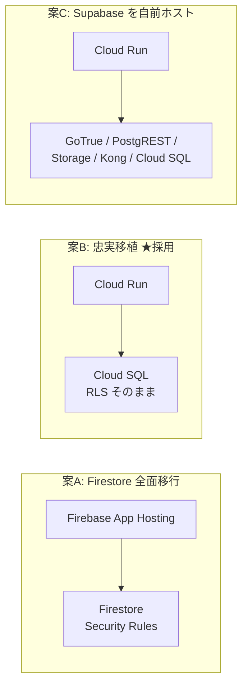
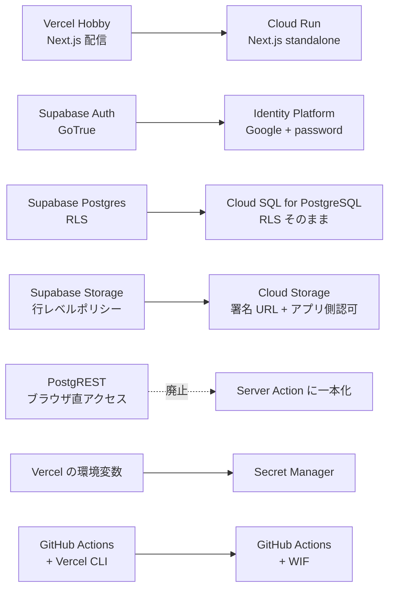
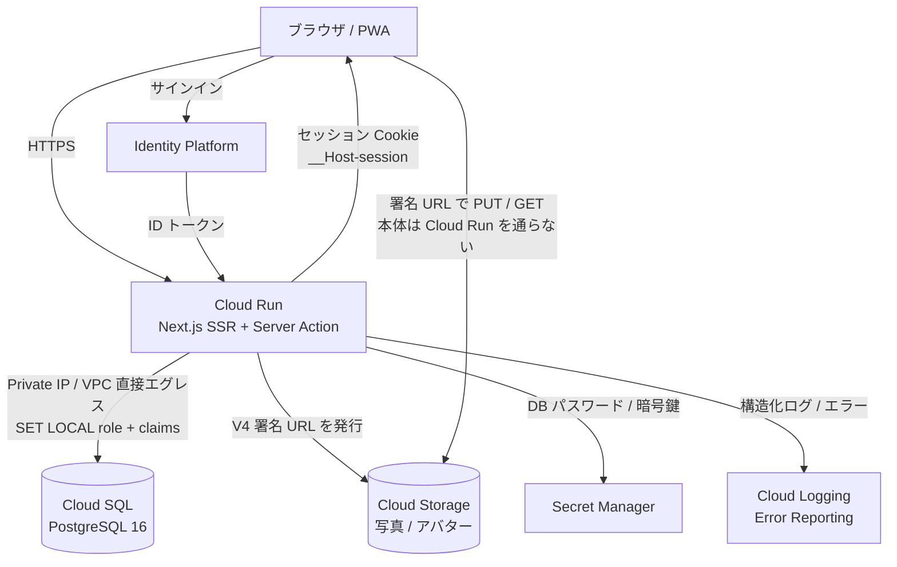
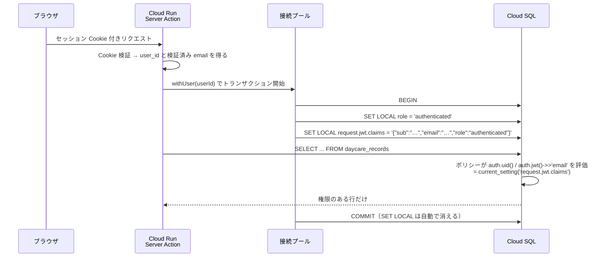
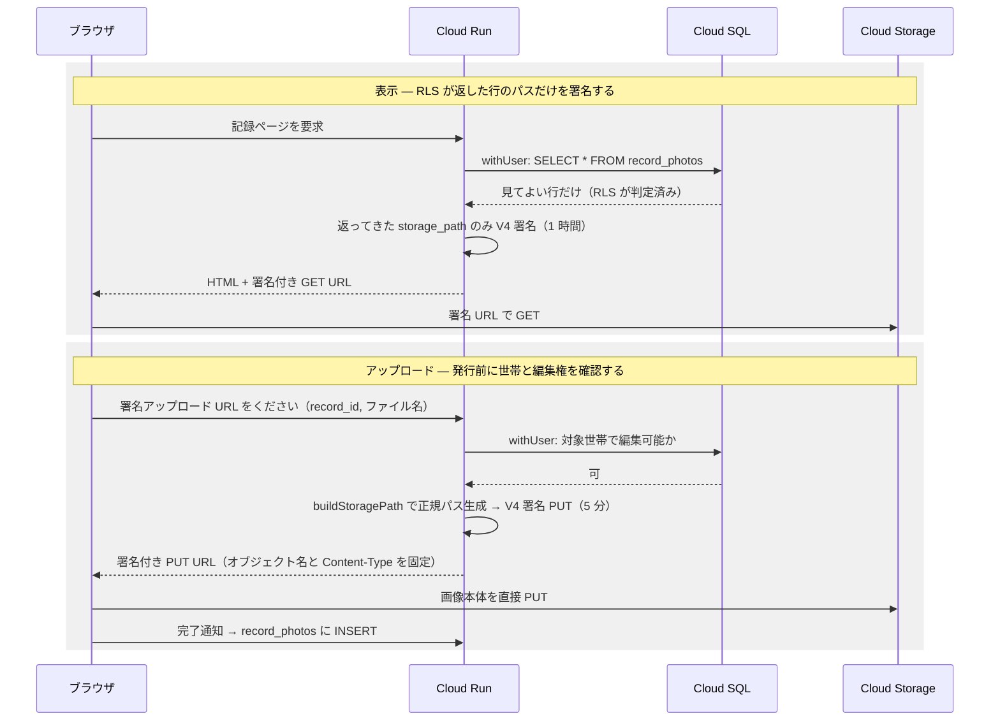
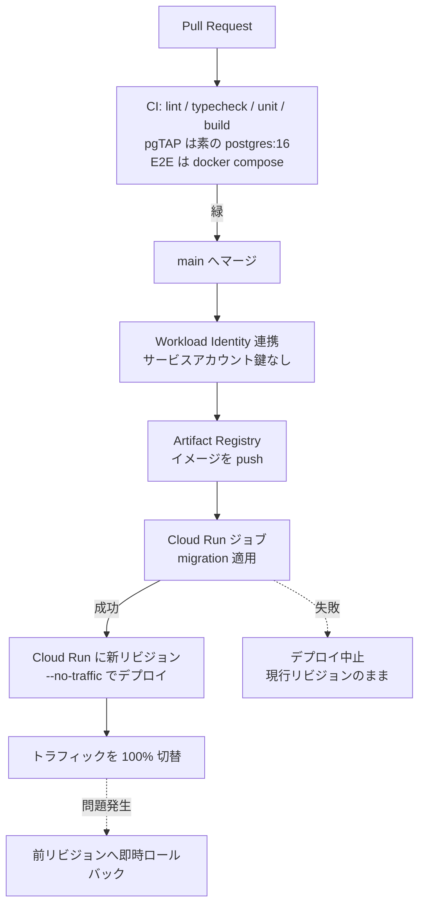
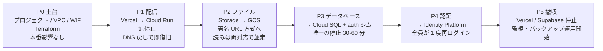

# インフラを Google Cloud へ寄せる — アーキテクチャ案

Vercel Hobby + Supabase Free（[D18](./decisions.md)）で動いている mfmf を、
**Google Cloud だけで完結する構成**へ置き換えるための設計案です。まだ決定ではありません
（採否を決めたら [decisions.md](./decisions.md) に 1 行足してください）。

このドキュメントは「なぜその形か」と「どこが難所か」を残すためのものです。
現状の仕様（テーブル・画面・RLS）は書きません（[D16](./decisions.md)）。正はコードです。

---

## 0. 先に結論

| | |
| --- | --- |
| **採る形** | Cloud Run（Next.js）＋ Cloud SQL for PostgreSQL ＋ Identity Platform ＋ Cloud Storage |
| **守るもの** | `public` の **RLS 90 本**、**Storage に触らない関数定義 18 本**、**pgTAP 5 ファイル**を無改変で動かす |
| **作り直すもの** | Storage の行レベルポリシー 43 本、**`delete_own_household` 1 本**、**pgTAP 4 ファイル**（§4.2） |
| **捨てるもの** | ブラウザ → PostgREST の直接アクセス（`supabase-js` のクエリビルダ） |
| **費用** | **月 ¥0 → 約 ¥2,000**（Cloud SQL がほぼ全部）。D18 の「無料枠で完結」は成立しなくなる |
| **止まる時間** | DB 切替の 1 回だけ、30〜60 分程度 |

**最大の懸念を先に書きます。この移行の対価は月 ¥2,000 と運用対象の増加で、
D18（無料枠で完結・運用対象を増やさない）と正面から衝突します。**
それでも意味があるのは、Free 枠には無い**自動バックアップ・PITR・写真の世代管理**が
手に入り、[D22](./decisions.md) が「唯一のロールバック資産」「写真の事故からは戻せない」と
書いて許容していたリスクが消えるからです。ここを引き受けるかどうかが唯一の判断ポイントで、
以降はそれを引き受けた前提で最後まで設計してあります。

---

## 1. いま何を移すのか

移行の規模は Supabase への依存の深さで決まります。棚卸すとこうなります。

| 依存している Supabase の機能 | 規模 | 移行の難度 |
| --- | --- | --- |
| Postgres のテーブル | 13 | 低（`pg_dump` / `pg_restore`） |
| **`public` の RLS ポリシー** | **90** | **中 — `auth.uid()` を自前で再現できるかに全部かかっている** |
| **`storage.objects` の RLS ポリシー** | **43** | **高 — Cloud Storage に等価物が無い。設計を変える** |
| SECURITY DEFINER ほかの関数定義 | 19 | 低 — ただし **`delete_own_household` だけは `storage.objects` / `storage.foldername()` を直接引く**ので作り直し（§4.2） |
| pgTAP のテナント分離テスト | 9 ファイル | **5 ファイルは無改変。4 ファイルは Storage を触るので作り直し**（§4.2） |
| Auth（Google OAuth + email/password、Cookie セッション） | — | 中（UID を保ったまま移せるかが鍵） |
| Storage（private バケット 2 つ、ブラウザ直アップロード、署名 URL） | — | 高 |
| Realtime / Edge Functions | **未使用** | — |

未使用のものが 2 つあるのは幸運です。移すのは **DB・認証・ファイル**の 3 つだけで、
そのうち難所は **RLS の再現**と **Storage の認可**の 2 点に集中しています。

---

## 2. 3 つの案と、却下したもの

| 案 | 費用/月 | コード変更 | 却下/採用の理由 |
| --- | --- | --- | --- |
| **A. Firestore + Firebase App Hosting** | 約 ¥0 | **全面書き換え** | **却下。** 費用は最良だが、13 テーブルの結合・`pg_trgm` の部分一致検索・**90 本の RLS と 9 本の pgTAP** が全部消える。セキュリティの一次防衛線を書き直したうえで、それを守るテストも書き直すことになる（`CLAUDE.md` セキュリティ節の前提が崩れる）。家族 5 人のアプリでこのリスクを取る理由がない |
| **B. Cloud Run + Cloud SQL + Identity Platform + GCS** | 約 ¥2,000 | **データアクセス層のみ** | **採用。** SQL と RLS が資産として残る。`auth` スキーマの互換シム（§4.1）で migration も pgTAP も**無改変**で動く。書き換えるのは `supabase-js` のクエリビルダを呼んでいる箇所と、Storage の認可 |
| **C. Supabase OSS を Cloud Run で自前ホスト** | 約 ¥3,500〜 | **ほぼ無し** | **却下。** コード変更が最小という一点は魅力だが、GoTrue・PostgREST・storage-api・Kong の 4 コンテナを自分でバージョン管理・監視・アップデートすることになる。「運用対象を増やさない」（D18）に最も強く反する案で、費用も一番高い。コードを守るために運用を買うのは逆 |

---

## 3. 目標アーキテクチャ

### 3.1 レイヤの対応

置き換えの中で**唯一なくなる箱が PostgREST** です。今はブラウザから直接 DB を触る経路が
残っていますが（`src/lib/supabase/client.ts`）、Cloud SQL は Private IP に閉じるので
**データの読み書きは全て Server Action / Server Component 経由**になります。
これは制約であると同時に、`CLAUDE.md` の「データ変更は Server Action で行う」規約に
実態を合わせることでもあります。

### 3.2 リクエストの経路

要点は 3 つです。

- **画像の本体は Cloud Run を通りません。** 今も Vercel の 4.5MB ボディ上限を避けるために
  ブラウザから Storage へ直接上げていますが（`RecordForm`）、この形はそのまま維持します。
  Cloud Run の上限は 32MB なので制約としては緩みますが、**転送とメモリを Cloud Run に
  払わせない**利点の方が大きいので変えません。
- **Cloud SQL は Public IP を持ちません。** Cloud Run から VPC 直接エグレスで Private IP に
  つなぎます。インターネットから DB に到達する経路が存在しない状態にします。
- **サービスアカウントの JSON 鍵はどこにも置きません。** 署名 URL の発行は鍵ファイルではなく
  IAM の `signBlob` で行い（§4.2）、GitHub Actions は Workload Identity 連携で認証します（§5）。

### 3.3 配信まわりの割り切り

| 論点 | 決め |
| --- | --- |
| 独自ドメイン | **Cloud Run のドメインマッピング**を使う。グローバル外部 ALB は転送ルールだけで月 ¥2,700 ほどかかり、家族 5 人のアプリでは CDN と Cloud Armor の価値が費用に見合わない |
| コールドスタート | **最小インスタンス 0**。常時 1 台にすると月 ¥1,500〜9,000 上乗せになる。**遅延は利用者に見えます** —— `public/sw.js` はナビゲーションを `fetch(request).catch(() => caches.match("/offline"))` で処理しており、**ネットワーク応答を待ちます**（アプリシェルを先に出す実装ではない）。したがって初回遷移はコールドスタート分だけ白いまま。P1 で実測し、許容できなければ最小 1 台へ倒す |
| next/image の最適化 | **不要**。リモート画像は全て `unoptimized` で、縮小はブラウザ側（[D20](./decisions.md)）。`sharp` を積む必要がない |
| リージョン | `asia-northeast1`（東京）。利用者も Cloud SQL も同じ場所に置く |

---

## 4. 難所は 2 つ半

### 4.1 難所その 1 — RLS を Supabase 無しで動かす

**RLS を捨てないことがこの移行の成否です。** `CLAUDE.md` が「セキュリティの一次防衛線は
Supabase の RLS」と書き、pgTAP がそれを CI で守っている以上、ここを弱めた時点で移行は失敗です。

Supabase がやっていることは、実は魔法ではありません。PostgREST が JWT を検証し、
**トランザクションの頭で 2 行の `SET LOCAL` を実行しているだけ**です。
`auth.uid()` はその設定値を読む関数にすぎません。であれば、同じことを自分でやればよい。

用意するのは以下だけです。

- **`auth` スキーマの互換シム** —— **通常の migration として後ろに足してはいけません**（後述）
  - `auth.uid()` / `auth.jwt()` / `auth.role()` — `current_setting('request.jwt.claims', true)` を読む
  - ロール `anon` / `authenticated` / `service_role`
  - **`auth.users` テーブル** — 13 箇所の外部キーの参照先。Identity Platform を正とし、
    サインイン時に `id` / `email` を upsert して同期する
- **`withUser()` ヘルパー**（`src/lib/db/`）— 上のシーケンスの `SET LOCAL` を必ず通す唯一の入口

> **claims には `email` も必ず入れること。** `sub` と `role` だけでは足りません。
> `20260704010000_household_invites.sql:79` の `invites_select_invitee` は
> `lower(email) = lower(coalesce(auth.jwt() ->> 'email', ''))` で判定しているため、
> `email` が空だと**招待の受諾画面（`/invite/[token]`）が全ての有効な招待を「無効」と表示します。**
> 入れる値は **ID プロバイダが検証済みとしている email** に限ること（自己申告の email を
> 入れると、他人の招待を受諾できる経路になります）。

> **シムは migration 履歴より前に流すこと。** `20260616130704_init.sql` が最初の 1 行目から
> `auth.users` を参照しているので、**新しいタイムスタンプの migration として足すと間に合いません**
> （履歴の最後に来るため）。`supabase/bootstrap/000_auth_shim.sql` のような
> **プレマイグレーション**として、CI・staging・災害復旧のいずれでも履歴の再生前に適用します。
> `just check` と CI の DB 起動手順にこの 1 ステップを組み込むこと。

これで **`public` の 90 本のポリシー**と、**Storage を参照しない 18 本の関数定義**、
**9 ファイル中 5 ファイルの pgTAP** は 1 行も変えずに動きます。
残りは Storage 側の事情で作り直しになります（§4.2）。
なお pgTAP は `supabase` CLI を起動せず素の `postgres:16` コンテナで回せるようになり、CI は速くなります。

> **`SET LOCAL` であることが重要です。** 接続プールで使い回すので、`SET`（セッション単位）だと
> 前のリクエストのユーザー権限が次のリクエストに漏れます。トランザクション外で DB に触る
> 経路を作らないこと、`withUser()` を迂回する生の `pool.query()` を書かないことを、
> lint ルールか `eslint-plugin-no-restricted-imports` で機械的に縛るべきです。

書き換えが要るのは **`supabase.from(...)` を呼んでいる箇所**（Server Action と Server Component の
データ取得）です。ここは素の SQL でも Kysely 等でも構いませんが、`withUser()` の外では
実行できない形にしておきます。

### 4.2 難所その 2 — Storage の 43 本のポリシーを何に置き換えるか

**Cloud Storage にはオブジェクト単位の宣言的ポリシーがありません。** Firebase の
Storage Rules はありますが、判定に「その世帯のメンバーか」を Postgres へ問い合わせることが
できないので、`{household_id}/{record_id}/{filename}` 規約の認可には使えません。

そこで **「RLS が返した行だけ署名する」** という形にします。認可の判断者は RLS のままです。

- バケットは **均一バケットレベルアクセス**＋**公開アクセス防止**を強制。匿名で読める経路をなくす
- 署名 URL は**オブジェクト名まで固定**して発行する。パスはクライアントの申告ではなく
  `buildStoragePath()` がサーバー側で組み立てる（`src/lib/storagePath.ts` はそのまま使える）
- 署名は**サービスアカウント鍵ではなく IAM の `signBlob`** で行う。Cloud Run のサービス
  アカウントに自分自身への `roles/iam.serviceAccountTokenCreator` を与えれば、鍵ファイル無しで V4 署名できる
- **バケットに CORS 設定を入れる。** 署名 V4 の PUT は GCS 側では通っても、`Content-Type` を
  付けるためブラウザが preflight（`OPTIONS`）を投げます。アプリのオリジン・`PUT`・
  必要なヘッダを許可しておかないと、**署名が正しくても全てのアップロードがブラウザで落ちます。**
  P2 のインフラ手順に必ず含めること
- **PUT だけ成功して INSERT が失敗した孤児オブジェクト**は必ず出るので、Cloud Scheduler +
  Cloud Run ジョブで日次掃除する（`record_photos` に無いオブジェクトを削除）。
  **ただし「作成から一定時間（例: 24 時間）以上経過したもの」に限ること** —— 正常な
  アップロードでも PUT 成功から INSERT までには必ず間があり、その隙に掃除が走ると
  **INSERT は成功するのに実体が消えた行**ができます

#### アバターのバケットも設計する

写真だけ設計して終わりにはできません。**private バケットは 2 つあります。**
`AvatarUploader` は `buildAvatarPath()` で `avatars` バケットへ直接上げており、
規約は `{scope_id}/avatars/{...}`、**`scope_id` はユーザー / 世帯 / ペットの 3 通り**、
参照元テーブルも認可スコープも別々です（`20260706120000_avatars.sql` の
`avatars_{select,insert,delete}_scope` 3 本）。写真用の「`record_id` を渡す」経路も
`buildStoragePath()` の規約もそのまま流用できません。

したがって **P2 では署名 URL の発行口をスコープごとに分けて用意します**
（ユーザー本人 / 世帯メンバーシップ / ペットの所属世帯）。判定は写真と同じく
「RLS が返したか」に寄せ、**差し替え時の旧オブジェクト削除**（いま
`settings/actions.ts` と `pets/actions.ts` が `remove()` でやっていること）も
サーバー側の削除経路として作り直します。ここを P2 のスコープに入れ忘れると、
アバターの表示・変更・削除が丸ごと壊れます。

#### `delete_own_household` は書き直しになる

「関数はそのまま動く」の唯一の例外です。`20260705040000_household_delete.sql` の
`delete_own_household` は `storage.objects` を直接引き、`storage.foldername(o.name)[1]` で
**その世帯の写真が残っている間は削除を拒否する**ガードを持っています。
Supabase Storage のスキーマが無くなればこの関数は**インストールすら失敗**し、
空の互換テーブルを置けば**ガードが常に素通りして、実体の残った GCS オブジェクトを
置き去りに世帯とメンバーシップだけが消えます**（どちらも許容できない）。

**GCS のプレフィックス確認は、認可済みの削除フロー側（Server Action）へ移します。**
DB 側の関数からは Storage 依存のガードを外し、「オブジェクトが残っていないこと」の
確認と実削除はアプリが行う、という分担にします。

#### pgTAP は 5 ファイル残り、4 ファイルは作り直す

「pgTAP 9 ファイルを無改変」とは書けません。`storage.` を参照しているのは 4 ファイルで、
Storage スキーマの無い素の Postgres では**そのまま落ちます**。
互換用のダミースキーマを置いて緑にするのは**最悪手**です —— 新しい GCS 認可を
何も検証しないまま「テストは通っている」ように見えるからです（V4: 壊れても緑に見える）。

| pgTAP ファイル | `storage.` 参照 | 移行後 |
| --- | --- | --- |
| `guest_grants_test` / `guest_invites_test` / `household_invites_test` / `household_provisioning_test` / `household_rls_test` | 0 | **無改変** |
| `household_delete_test` | 1 | Storage ガードの分だけ剥がす |
| `household_rbac_test` | 5 | Storage 部分を剥がす |
| `household_storage_tags_test` | 21 | Storage 部分は削除し、tags 部分だけ残す |
| `avatars_test` | 24 | **ほぼ全部が Storage ポリシー**。作り直し |

剥がした分の担保は **Integration 層（Vitest + 実 DB + fake-gcs-server）へ移します** ——
「どのスコープなら署名 URL が発行されるか / されないか」を検証する層です。
[D30](./decisions.md) の割り当て原則（その層でしか捕まらないものを置く）に従うと、
アプリ層の認可判断は元々 Integration の担当なので、位置としても正しい移動になります。
**この移し替えを P2 の完了条件に含めること。**

**これは `CLAUDE.md` の記述を変える変更です。** 「一次防衛線は RLS」は DB については変わりませんが、
**Storage については「アプリ層の認可 ＋ 短命の署名 URL」に変わります。**
移行時にセキュリティ節を書き換えてください（黙って変えると、次のセッションのエージェントが
古い前提で Storage を触ります）。

代わりに得るものもあります。**オブジェクトのバージョニングとソフト削除**を有効にすれば、
D22 が「写真の事故からは戻せないことを許容」と書いた穴が埋まります。

### 4.3 難所その半分 — 認証と、Google Drive の refresh token

利用者から見て一番リスクが高いのは「ログインできなくなる」ことです。ここは
**UID を保ったまま移す**ことで、ほぼ無傷にできます。

- Supabase の `auth.users` を書き出し、**`uid` を指定したまま** Identity Platform へ一括インポートする。
  パスワードは bcrypt ハッシュのまま持ち込めるので、**パスワード再設定は不要**
- UID が変わらないので、13 テーブルの `owner_id` / `user_id` は**一切書き換え不要**
- Google ログインのユーザーは `emailVerified: true` で入れておけば、同じメールで自動的に紐づく
- セッションは Cookie（`__Host-session`）。Firebase Admin SDK の `createSessionCookie` で発行し、
  `src/middleware.ts` で検証する。**Node ランタイムで動く前提**（Cloud Run なので問題なし）
- **移行時に全員が 1 度だけ再ログインします。** 事前に告知が要る唯一の利用者影響です

**見落としやすい罠が 1 つあります。** `google_credentials` の refresh token です。
今は Supabase の Google OAuth が `provider_refresh_token` を返してくれるので
`/auth/callback` で保存できていますが（`src/lib/google/token.ts`）、
**Identity Platform のログインは Drive スコープの offline refresh token を返しません。**

したがって **Drive 連携はログインとは別の OAuth フローに分離**します。
「ログイン」＝ Identity Platform、「Drive 連携」＝ アプリ自身の OAuth 同意画面
（`google-auth-library` で `access_type=offline`）という 2 本立てです。
暗号化保存の仕組み（`src/lib/google/crypto.ts`）と `google_credentials` テーブルはそのまま使えます。
既存ユーザーの refresh token は Supabase の OAuth クライアントに紐づくため、
**クライアントを変えるなら Drive 連携だけは再同意が必要**です。

---

## 5. CI/CD と環境

いまの `deploy-production.yml` の骨格（**CI が緑のときだけ migration → デプロイ**）は
そのまま持ち込めます。変わるのは中身です。

| いま | 移行後 |
| --- | --- |
| `supabase db push` | migration 適用専用の **Cloud Run ジョブ**（アプリと同じイメージ・同じ VPC） |
| デプロイ前に `pg_dump` して Artifact に 90 日保存（**唯一のロールバック資産**） | **Cloud SQL の自動バックアップ ＋ PITR（7 日）**。加えてデプロイ直前にオンデマンドバックアップ |
| `vercel deploy --prebuilt --prod` | `gcloud run deploy --no-traffic` → `--to-latest` |
| 失敗したら Artifact から手で復元 | `gcloud run services update-traffic --to-revisions=前リビジョン=100`（数十秒） |
| ローカルは `supabase start` | `docker compose`（postgres + Auth エミュレータ + fake-gcs-server） |
| CI で `supabase/setup-cli` を固定バージョン取得 | 不要になる（GitHub API のレートリミットで CI が落ちる問題も消える） |

`ci.yml` に昇格権限を足さない制約（`deploy-production.yml` からの `workflow_call` 再利用）は
そのまま守ります。WIF の権限はデプロイ側のワークフローにだけ持たせます。

**環境は 2 つに増やせます。** Supabase Free は「active 2 プロジェクト」の制約があり
[D22](./decisions.md) は preview 用の別プロジェクトを断念していますが、Cloud SQL なら
同一インスタンス内に staging データベースを作るだけで済みます（追加費用ほぼゼロ）。
Cloud Run のリビジョンタグでプレビュー URL も出せます。

---

## 6. 費用（東京リージョン、家族数人の利用を想定）

| 項目 | 構成 | 月額の目安 |
| --- | --- | --- |
| **Cloud SQL for PostgreSQL** | 共有コア（db-f1-micro）、10GB SSD、ゾーン構成 | **約 ¥1,700** |
| Cloud Run | 最小インスタンス 0、月 200 万リクエストの無料枠内 | 約 ¥0 |
| Cloud Storage | 10GB Standard + 取り出し | 約 ¥50 |
| Identity Platform | 月間 5 万 MAU まで無料 | ¥0 |
| Artifact Registry | イメージ数世代 | 約 ¥30 |
| Secret Manager / Logging / Monitoring | 無料枠内 | 約 ¥0 |
| Cloud Run ドメインマッピング | ALB を使わない | ¥0 |
| **合計** | | **約 ¥1,800 / 月** |

**費用の 9 割以上が Cloud SQL です。** ここを削る手段は実質ありません
（GCP に無料の Postgres は無い）。逆に言えば、月 ¥1,800 は
「自動バックアップ・PITR・Private IP・staging 環境」を買う値段です。

**必ず予算アラートを設定してください**（月 ¥3,000 で 50% / 90% / 100% 通知）。
Supabase Free と違い、GCP は上限に当たって止まるのではなく課金され続けます。
これは移行で新たに増えるリスクで、金額そのものより性質が変わる点が重要です。

---

## 7. 移行計画 — 5 段階、それぞれ単独で戻せる

一気に切り替えないこと。**各フェーズの終わりで本番が動いていて、前のフェーズへ戻せる**
順序にしてあります。難所（DB）を真ん中に置き、利用者影響のある認証を後ろに寄せています。

| | やること | 戻し方 |
| --- | --- | --- |
| **P0** | GCP プロジェクト、VPC、Artifact Registry、WIF、Secret Manager、Terraform 化。本番は Vercel + Supabase のまま | 何も本番に触っていない |
| **P1** | `output: "standalone"` 化と Dockerfile 整備、Cloud Run へデプロイ、ドメイン切替。**接続先は Supabase のまま** | DNS を Vercel に戻す |
| **P2** | GCS バケット作成、`rclone` で既存オブジェクトを同期（Supabase Storage は S3 互換なのでそのまま繋がる）、署名 URL 方式へ実装変更、**読み取りは一定期間 GCS 優先・無ければ Supabase にフォールバック**、差分再同期 | 読み取りのフォールバックを逆向きにする |
| **P3** | `auth` 互換シムを**プレマイグレーション**として整備、`withUser()` とデータアクセス層の書き換え、pgTAP をローカル Postgres で緑にする。**本番は読み取り専用にして `pg_dump` → Cloud SQL へ復元 → 接続先切替**。ここだけ停止が要る | **書き込みを再度止め、Cloud SQL の差分を Supabase へ逆同期してから**接続先を戻す（下記） |
| **P4** | Identity Platform 設定、UID 保存の一括インポート、セッション Cookie 実装、Drive 用 OAuth の分離、`auth.users` 同期 | **パスワード変更・リセットを凍結したうえで** ID プロバイダを Supabase Auth に戻す（下記） |
| **P5** | Vercel プロジェクト削除、Supabase プロジェクト一時停止（**すぐ消さず 1 か月置く**）、予算アラート・稼働監視・バックアップ復元手順の整備 | — |

**P3 の前に、本番データのコピーで復元リハーサルを 1 回通してください。**
`pg_dump` から Cloud SQL 復元、pgTAP 緑、アプリ起動、写真表示まで。
ここを踏まずに当日やると、停止時間が読めません。

### 7.1 ロールバックは「接続先を戻すだけ」では済まない

上の表の「戻し方」は、**切替直後（まだ 1 件も書き込みが起きていない時点）でしか成立しません。**
ここを楽観していたので、明示的に直しておきます。

**P3 —— サービス再開後に書かれたものは Cloud SQL にしかありません。**
読み取り専用にするのは初回ダンプと切替の間だけなので、Cloud SQL で動き始めた瞬間から
新しい記録・編集は Cloud SQL 側にだけ積まれます。この状態で単に接続先を Supabase へ戻すと、
**その間の記録が消えます。**ロールバック手順は必ずこうします。

1. 書き込みを**再度**止める（メンテナンスモード）
2. Cloud SQL の差分を Supabase へ**逆方向にコピー**する（`pg_dump --data-only` ＋ 突き合わせ）
3. 逆同期の完了を確認してから接続先を戻す

これが重すぎるなら、**切替後 N 日間は論理レプリケーションか二重書き込みを維持する**か、
**「切替から N 時間を過ぎたら前に進むだけ（ロールバックしない）」と決めて**、
問題は Cloud SQL 側で直す方針にします。どちらを採るかは P3 の実施前に決めること。

**P4 —— 認証は「戻せば元通り」ではありません。**
P4 が動き始めると、パスワード変更・パスワードリセットは **Identity Platform 側だけ**を
更新します。同期は `auth.users` を Cloud SQL へ写すだけで、**Supabase の GoTrue には何も戻しません。**
この間にパスワードを変えた利用者がいる状態で Supabase Auth へ戻すと、**古い資格情報が復活し、
本人がログインできなくなります。**ロールバック時は、
**パスワード変更・リセットを凍結する**か、**新しい資格情報を GoTrue へ書き戻す逆手順を用意する**
かのどちらかが要ります。実務的には、**P4 の切替直後 24 時間はパスワード変更系の導線を
一時的に閉じておく**のが一番安く済みます。

---

## 8. 移行で得るもの・失うもの

| | |
| --- | --- |
| **得る** | 自動バックアップと PITR（D22 の「唯一のロールバック資産」問題が解消） |
| | 写真の世代管理・ソフト削除（D22 が許容していた「写真は戻せない」が解消） |
| | staging 環境が持てる（D22 が Free 枠の制約で断念したもの） |
| | DB が Private IP に閉じる（インターネットからの到達経路が消える） |
| | 認証・DB・ファイル・配信・CI の権限が IAM 1 か所に集約される |
| | CI から `supabase` CLI が消える（レートリミット由来の CI 落ちが消える） |
| **失う** | **月 ¥0**（D18 の前提） |
| | Supabase Studio 相当の管理 UI（`psql` と Cloud Console になる） |
| | Storage の宣言的な行レベルポリシー（アプリ層の認可に移る = 4.2） |
| | ブラウザから DB を直接叩ける手軽さ（Server Action 一本になる） |
| | 「上限に当たったら止まる」安心（従量課金になる = 予算アラートで代替） |

---

## 9. まだ決めていないこと

1. **月 ¥1,800 を払うか。** これが唯一の本質的な判断です。払わないなら、この案は成立しません
   （案 A まで落とすと RLS と pgTAP を失うので、それなら現状維持の方が良いと考えます）
2. **Sentry を残すか。** ブラウザ側の JS エラーは Cloud Error Reporting では拾えないので、
   サーバー = Cloud Logging / Error Reporting、クライアント = Sentry の併用を推します。
   「全部 GCP」に厳密に寄せるなら、クライアントエラーは自前の `/api/vitals` 相当に送る形になります
3. **データアクセス層に何を使うか**（素の `pg` / Kysely / Drizzle）。`withUser()` を迂回できない
   形にできればどれでも構いません
4. **Drive 連携の再同意を求めるか**（OAuth クライアントを変えるかどうか、§4.3）

---

## 参照

- 現行構成: [reference/architecture.md](../reference/architecture.md)
- 現行のデプロイ手順: [guides/deploy.md](../guides/deploy.md)
- 関係する決定: [decisions.md](./decisions.md) の D18（無料枠）・D20（クライアント側リサイズ）・
  D22（デプロイとバックアップ）・D23（Service Worker のキャッシュ禁止）・D30（テスト 4 層）
